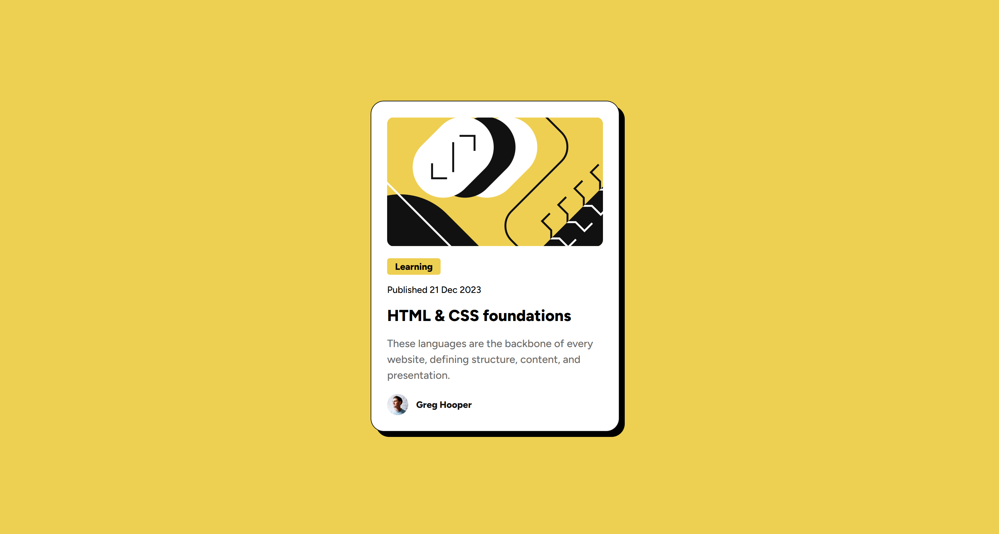

# Frontend Mentor - Blog preview card solution

This is a solution to the [Blog preview card challenge on Frontend Mentor](https://www.frontendmentor.io/challenges/blog-preview-card-ckPaj01IcS). Frontend Mentor challenges help you improve your coding skills by building realistic projects. 

## Table of contents

- [Overview](#overview)
  - [Screenshot](#screenshot)
  - [Links](#links)
- [My process](#my-process)
  - [Built with](#built-with)
  - [What I learned](#what-i-learned)
  - [Continued development](#continued-development)
- [Author](#author)
- [Acknowledgments](#acknowledgments)

---

## Overview

This project is a simple **blog preview card**, designed to highlight a blog article with its image, category, publication date, title, short description, and author details.  
The goal of the challenge was to **replicate the provided design** as closely as possible using only **HTML and CSS**, while ensuring responsiveness and visual balance.

The layout features a clean and minimal card centered on the page, with soft borders, a subtle shadow, and a hover effect on the title for interactivity.  
It was a short but useful exercise to practice **typography, spacing, and component styling**.

### Screenshot

### Links

- **Solution URL:** [https://www.frontendmentor.io/solutions/blog-preview-card-html-css-flexbox-LvP0r9xy7z](https://www.frontendmentor.io/solutions/blog-preview-card-html-css-flexbox-LvP0r9xy7z)  
- **Live Site URL:** [https://blog-preview-card-schima.netlify.app/](https://blog-preview-card-schima.netlify.app/)

---

## My process

I started by creating the base structure in HTML, keeping the layout semantic and easy to read.  
Once the markup was ready, I applied styles incrementally — first defining the typography and spacing, then focusing on layout centering with Flexbox.  

After achieving the basic look, I added the hover interaction on the title and refined small details such as shadows, borders, and font weights to better match the design reference.

### Built with

- Semantic **HTML5** markup  
- **CSS custom properties**  
- **Flexbox** for layout alignment  
- **Clamp()** for responsive width control  
- **Mobile-first workflow**  
- Simple and clean **component-based design**

---

### What I learned

I'm proud of how quickly I developed the solution.  
Since this was a basic exercise, I didn’t encounter any major challenges — just a few small doubts about CSS details like spacing and hover behavior.

Key takeaways:
- Centering elements efficiently with **Flexbox**.  
- Using **`clamp()`** to make the component width adapt fluidly.  
- Combining **borders and shadows** to create depth while maintaining a minimalist design.  

Here’s a CSS snippet I’m proud of:

.card {
  width: clamp(150px, 80vw, 327px);
  background-color: white;
  border-radius: 20px;
  border: 1px solid hsl(0, 0%, 7%);
  padding: 24px;
  box-shadow: 8px 8px #000000;
}

## Continued development

In future projects, I want to:

- Improve CSS code organization and naming conventions.
- Focus more on typographic scale and vertical rhythm for better readability.
- Explore CSS Grid for multi-column layouts.
- Refine color contrast and accessibility according to WCAG standards.
- Continue practicing clean and maintainable front-end architecture.

## Author

Website: [Schima](https://schima.it/)

Frontend Mentor: https://www.frontendmentor.io/profile/edoardozampini

GitHub: (https://github.com/edoardozampini)
